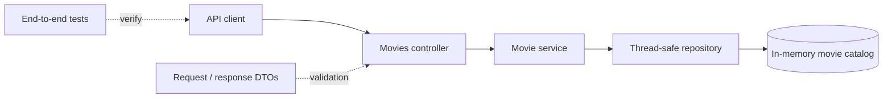

# Movie API

[](https://github.com/Robert-Pelot/MovieAPI/actions/workflows/ci.yml)
[](https://dotnet.microsoft.com/)

A small, production-minded ASP.NET Core REST API that demonstrates validated CRUD operations over a thread-safe in-memory movie catalog.

**Portfolio:** [Life in Your 50s — Projects](https://mystorageaccountusasa.z13.web.core.windows.net/projects.html)

## 30-second overview

| | |
|---|---|
| **Problem** | Provide a clean REST interface for creating, reading, updating, filtering, and deleting movies |
| **Stack** | C#, ASP.NET Core, .NET 10 |
| **Architecture** | Controllers → services → repository |
| **Persistence** | Thread-safe in-memory repository |
| **API quality** | DTO validation, duplicate prevention, clear HTTP status codes, RFC 7807 validation responses |
| **Verification** | End-to-end API tests and GitHub Actions CI |

## Architecture



The API keeps HTTP concerns, application logic, domain data, and persistence responsibilities separate even though the persistence layer is intentionally lightweight.

## What this demonstrates

- Conventional REST endpoints and HTTP status codes
- Request and response DTOs separated from the domain model
- Server-side request validation
- Case-insensitive movie-name lookup and duplicate prevention
- Atomic, thread-safe repository operations
- Automatic RFC 7807 validation responses through ASP.NET Core
- End-to-end API testing
- GitHub Actions continuous integration

## Try it quickly

### Prerequisites

- [.NET 10 SDK](https://dotnet.microsoft.com/download/dotnet/10.0)
- Git

```bash
git clone https://github.com/Robert-Pelot/MovieAPI.git
cd MovieAPI
dotnet restore MovieApi.slnx
dotnet build MovieApi.slnx
dotnet run --project MovieApi.csproj
```

The default development profile listens on `http://localhost:5188`. OpenAPI JSON is available in Development at `http://localhost:5188/openapi/v1.json`.

### Example request

```bash
curl --request POST http://localhost:5188/api/movies \
  --header "Content-Type: application/json" \
  --data '{"name":"Arrival","genre":"Science Fiction","year":2016}'
```

A successful create returns `201 Created`. Missing resources return `404 Not Found`, duplicates return `409 Conflict`, and invalid requests return `400 Bad Request` with validation details.

## API

The API uses JSON and is rooted at `/api/movies`.

| Method | Endpoint | Success | Description |
| --- | --- | --- | --- |
| `GET` | `/api/movies` | `200 OK` | List every movie. An empty catalog is an empty array. |
| `GET` | `/api/movies?year=1994` | `200 OK` | List movies released in a given year. |
| `GET` | `/api/movies/{name}` | `200 OK` | Find a movie by its case-insensitive name. |
| `POST` | `/api/movies` | `201 Created` | Create a movie. |
| `PUT` | `/api/movies/{name}` | `204 No Content` | Replace a movie, including optionally renaming it. |
| `DELETE` | `/api/movies/{name}` | `204 No Content` | Delete a movie. |

### Request schema

| Field | Type | Rules |
| --- | --- | --- |
| `name` | string | Required, non-blank, at most 200 characters |
| `genre` | string | Required, non-blank, at most 100 characters |
| `year` | integer | Between 1888 and 2100 |

Leading and trailing whitespace in names and genres is removed before storage. Names are unique and matched without regard to letter casing.

Additional ready-to-run requests are in [`MovieApi.http`](MovieApi.http).

## Quality checks

```bash
dotnet restore MovieApi.slnx
dotnet build MovieApi.slnx --configuration Release
dotnet test MovieApi.slnx --configuration Release
```

GitHub Actions repeats the build and test suite automatically.

## Design decisions and tradeoffs

- **Layered structure:** controllers handle HTTP, services handle application behavior, and the repository owns persistence operations.
- **DTO/domain separation:** public API contracts are not the same objects used internally by the domain model.
- **Natural identifier:** movie names act as the current identifier and are matched case-insensitively; that keeps the API simple but is less flexible than an immutable ID.
- **Thread-safe storage:** repository operations are designed to remain atomic inside one running application instance.
- **In-memory persistence:** this keeps the project zero-configuration and easy to test, but data intentionally disappears on restart.

## Project structure

```text
Controllers/       HTTP routing and response mapping
Dtos/              Public API contracts and validation
Models/            Domain model
Repositories/      Thread-safe in-memory persistence
Services/          Application logic and DTO mapping
tests/             End-to-end API tests
.github/workflows/ Continuous integration
```

## Current limitations

- Data is held only in process memory and resets whenever the application restarts.
- The API intentionally has no authentication, authorization, paging, or rate limiting.
- Movie names act as natural identifiers; there is no separate immutable ID.
- The release-year upper bound is 2100 rather than a dynamically maintained catalog rule.
- The repository is suitable for a single application instance only; multiple instances do not share state.

These limits are documented deliberately so the project is clear about what it demonstrates and what a production deployment would still require.
